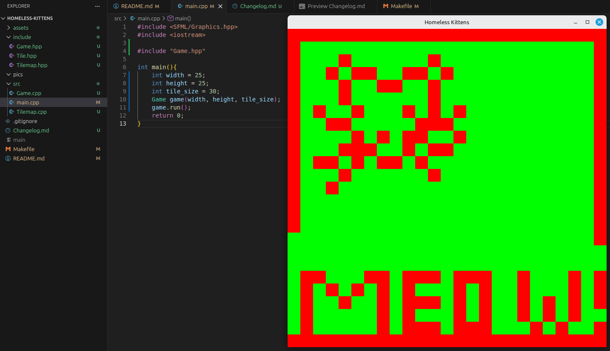

# Changelog  
This will be my changelog for the game. This is mostly so I can go back and see how far I have come (hopefully) when the game is finished.  

### Dec 2  - Log 1
This is my first log of the game, I have made superficial progress prior to this day and I just now had the idea for a game log sooooo we will mostly ignore the actual first day of development. The game will be on a 2D grid with multiple sprites interacting with each other, while the player will only interact with certain sprites thru clicking. So for today my goal was to tile the window, and be able to change the state of the tile with a click! This took around 2 hours. I started by creating a new architecture for the game: Tile, Tilemap, Game, main. main will just init the Game object. Game object creates a tilemap, which is a 2D array of Tile objects. For now Tile objects are simple things consisting of a bool and the color of the tile, later they will include sprites, and actual game objects. The TileMap obeject organizes these Tiles into a n by m grid as dictated by the width and height parameters in main, the actual size of these tiles is also defined in main. The TileMap obeject has a function to translate the local window pixel location to the grid location. I also created a toggle feature, so that if a click is made in the window, it will switch its color from red to green. I am still brand new to c++, and spent a lot of time trying to understand the syntax for classes. The next steps are to create a game object Kitty, and Trail? Conveyor Belt? So the Kitty follows the direction of the conveyor belt. Then add forks, which will change the direction of the conveyor belt. Here is a picture from day1! 
  
By the way, getting the position breaks when u resize the window, so I might just disable resizing the window if that is possible.